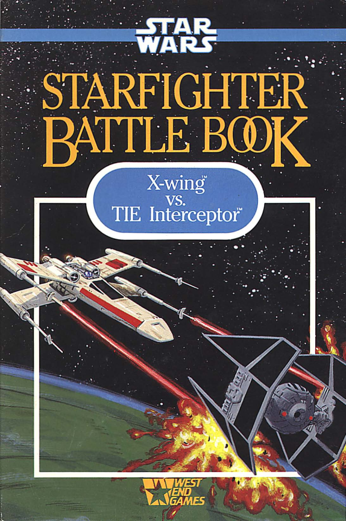

# Starfigher Battle Book

The **Star Wars: Starfighter Battle Book** is a in-cockpit flight simulation game using the page-flipping Ace of Aces game format, made in 1989 by West End Games. You can find more information on the book [here](https://boardgamegeek.com/boardgame/3152/star-wars-starfighter-battle-book).

<p align="center"></p>

As the book has become quite rare and expensive, I created a video game version that uses the visual aspect of it. Two players can compete locally or online. The game runs on Linux, Windows, and MacOS.

## Installation

* Go to the latest [release page](https://github.com/Rylern/StarfighterBattlebook/releases/latest), download and unzip one of the file corresponding to your operating system:
    * *StarfighterBattlebook-Linux.zip* for Linux.
    * *StarfighterBattlebook-Windows.zip* for Windows.
    * *StarfighterBattlebook-MacOS.zip* for MacOS.
* Double click on the *StarfighterBattlebook* executable file.

## Usage
The game uses the client-server architecture, which means that one of the player will have to **host** the game, and the other player will have to **join** the hosted game.

* To play locally (on the same network):
    * One player has to host the game by clicking on *Host game*. He/she then needs to find his/her local IP address. You can find instructions on how to get the local IP address on this [link](https://www.med.unc.edu/it/guide/operating-systems/how-do-i-find-the-host-name-ip-address-or-physical-address-of-my-machine/) for Windows, and [here](https://www.ionos.com/digitalguide/hosting/technical-matters/get-linux-ip-address/) for Linux and MacOS (on the *Displaying a private IP address in Linux* part).
    * The other player has to join the previously hosted game, by clicking on *Join game*, writing the local IP address of the host, and clicking on *Connect*.
* To play online (on a different network):
    * One player has to set up port forwarding on his/her router. The procedure depends on each router, but you can find instructions [here](https://www.belkin.com/support-article/?articleNum=10790). The port to forward is **55001** (**TCP**). Port forwarding may also have to been done on the firewall of the host computer.
    * The player who set up port forwarding has to host the game by clicking on *Host game*. He/she then has to find his/her IPv4 address by visiting [this website](https://whatismyipaddress.com/) for example.
    * The other player has to join the previously hosted game, by clicking on *Join game*, writing the IP address of the host, and clicking on *Connect*.

You also have the possibility to host a game from a remote server. To do this, grab the _StarfighterBattlebookServer-*.zip_ file from the latest release and run the *StarfighterBattlebookServer* file from a console. On this server, you also have to set up port forwarding as described above.

## Development
The game is a **C++** application using:
* The [Simple and Fast Multimedia Library (SFML)](https://www.sfml-dev.org/index-fr.php) library for everything related to graphics, audio, and network.
* [Cmake](https://cmake.org/) for the compilation process.
* [vcpkg](https://vcpkg.io/en/index.html) for acquiring and managing libraries (which actually only consists of SFML).
* [GitHub Actions](https://docs.github.com/en/actions) and [run-cmake](https://github.com/marketplace/actions/run-cmake) for automatically deploying and releasing the application.

The game also use images of the *Star Wars: Starfighter Battle Book*, and sound effects and musics of the original *Star Wars* trilogy. As I don't own any rights on these resources, I can unpublish them if requested.

To build the application (on Linux, the process should be similar on Windows and MacOS):
* Download C++ development tools (e.g. *g++*) and CMake.
* Run the following commands (in the project directory):
```
git clone https://github.com/Microsoft/vcpkg.git

./vcpkg/bootstrap-vcpkg.sh

vcpkg/vcpkg install

sudo apt-get -y install autoconf libtool libx11-dev libxrandr-dev libxi-dev libudev-dev libgl1-mesa-dev pkg-config # on Ubuntu

# release can be replaced by debug
cmake --preset=release
cmake --build --preset=release --target install --config release
``` 

After the build, the game can be found in the *bin/StarfighterBattlebook* directory, and the server in the *bin/StarfighterBattlebookServer* directory.

The code is organized as follow:
* The *server* folder contains the code for the *StarfighterBattlebookServer* executable, as well as the *Server* internal library used by the *StarfighterBattlebook* executable. This library handles the creation of the server when a player clicks on "Host game".
* The *utils* folder contains the code for the *Utils* internal library used by the *StarfighterBattlebook* executable. This library contains one utility function.
* The *ui* folder contains the code for the *Ui* internal library used by the *StarfighterBattlebook* executable. This library contains several classes to easily draw UI elements.
* The *include* folder contains the header files of the *StarfighterBattlebook* executable.
* The *src* folder contains the source files of the *StarfighterBattlebook* executable.